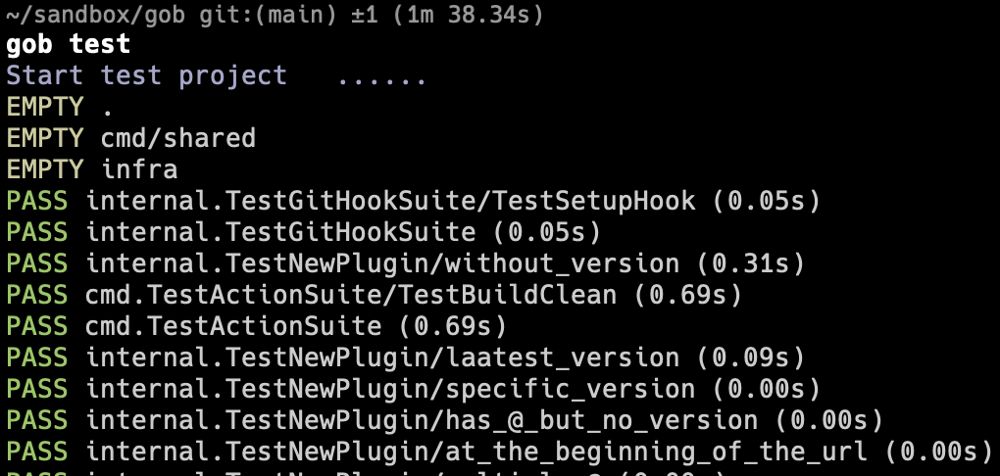
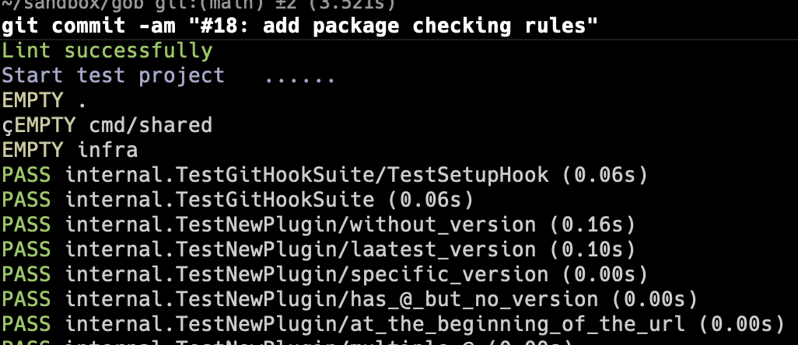

<p align="center">
Golang Project Boot
  <br/>
  <br/>
  <a href="https://github.com/kcmvp/gob/blob/main/LICENSE">
    
  </a>
  <a href="https://goreportcard.com/report/github.com/kcmvp/gob">
    
  </a>
  <a href="https://pkg.go.dev/github.com/kcmvp/gob">
    
  </a>
  <a href="https://github.com/kcmvp/gob/blob/main/.github/workflows/workflow.yml" rel="nofollow">
     
  </a>
  <a href="https://app.codecov.io/gh/kcmvp/gob" ref="nofollow">
    
  </a>

</p>

<span id="nav-1"></span>

<span id="nav-2"></span>

## Introduction

Although the Golang programming ecosystem is becoming more and more mature,
these tools and frameworks exist independently to solve specific problems.
Whenever a new Golang project is started, it requires a series of initialization;
What’s worse is that whenever your switch the development environment, same process have to be repeated!
This project is built to solve this problem by providing a method similar to [Maven](https://maven.apache.org/)
or [Gradle](https://gradle.com/) in the **Java** ecosystem.

<span id="nav-3"></span>

## Features

1. **Everything is a plugin, simple yet powerful !**
2. Build a tool chain and workflow without line code.
3. Better interaction user experience


## Quick Start
- Install `gob` with below command
```shell
    go install github.com/kcmvp/gob
```
- Initialize project with below comman d(in the project home directory)
```shell
  gob init
```

This command will do below initializations:
>  1. generate gob's configuration [gob.yaml](https://github.com/kcmvp/gob/blob/main/gob.yaml)
>  2. install gob's builtin plugins: [golangci-lint](https://golangci-lint.run/) & [gotestsum](https://github.com/gotestyourself/gotestsum)
>  3. setup three git hooks 
>     1. commit-msg 
>     2. pre-commit 
>     3. pre-push

- Execute `gob test` from project home directory  
 ```shell
gob test
```
>

- Try to commit your code see what will happen
git commit will trigger hooks
>


It's just the beginning, gob can do more than this! 
please refer [document](./docs/document.md) for details


## FAQ

