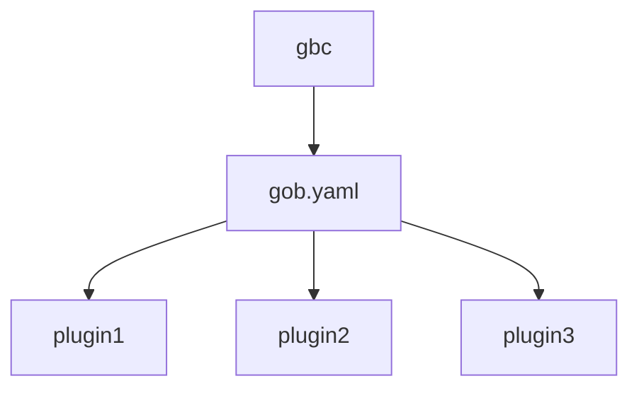

<p align="center">
Golang Project Boot
  <br/>
  <br/>
  <a href="https://github.com/kcmvp/gob/blob/main/LICENSE">
    
  </a>
  <a href="https://goreportcard.com/report/github.com/kcmvp/gob">
    
  </a>
  <a href="https://pkg.go.dev/github.com/kcmvp/gob">
    
  </a>
  <a href="https://github.com/kcmvp/gob/blob/main/.github/workflows/workflow.yml" rel="nofollow">
     
  </a>
  <a href="https://app.codecov.io/gh/kcmvp/gob" ref="nofollow">
    
  </a>

</p>

<span id="nav-1"></span>

<span id="nav-2"></span>

## Introduction

Although the Golang programming ecosystem is becoming more and more mature,
these tools and frameworks exist independently to solve specific problems.
Whenever a new Golang project is started, it requires a series of initialization;
What’s worse is that whenever your switch the development environment, same process have to be repeated!
This project is built to solve this problem by providing a tool named *gbc**, which is similar to [Maven](https://maven.apache.org/)
or [Gradle](https://gradle.com/) in the **Java** ecosystem together with a framework(glue) similar to [SpringBoot](https://spring.io/projects/spring-boot). Please refer [documents](#commands) for details

<span id="nav-3"></span>

## Features

1. Everything is a plugin, you can use any tool you like as a plugin to customize your build process!
2. Model driver SQL database DAO(data access object).
3. IoC Container support via [samber/do](https://github.com/samber/do).
4. Code generation for most popular frameworks scaffolding.
5. Environment sensitive profile. **application.yml** for no-test environment and **application-test.yml** for test environment
6. More ....

## What's a gob based project looks like?
Just like[SpringBoot](https://spring.io/projects/spring-boot), the most important part of a gob project is the **configurations** which define your project.
There are **two** main configurations
1. **gob.yaml** : it acts as the same as **settings.gradle.kts**( [Gradle](https://gradle.com/)) or **pom.xml**([Maven](https://maven.apache.org/)), you can define any thrid party tool as a plugin in this file.
2. **application.yaml**: it acts as the same **application.yaml** of [SpringBoot](https://spring.io/projects/spring-boot)


## Quick Start
1. Install `gbc` with below command
```shell
    go install github.com/kcmvp/cmd/gbc@latest
```
2. Initialize project with below command(in the project home directory)
```shell
  gbc init
```

| Make some changes and commit code                                                               | execute `gbc deps`                                                                                   |
|-------------------------------------------------------------------------------------------------|------------------------------------------------------------------------------------------------------|
|  |  |


## How gbc works
`gbc` takes everything defined in the `gob.yaml` as plugin.

You just need to tell `gbc` 3W(where,when and what)
1. **Where** : where to download the tool
2. **When** : when to execute to command
2. **What** : what to do with the tool


## Commands 

Build Commands
- [gbc init](#gbc-init)
- [gbc build](#gbc-build)
- [gbc clean](#gbc-clean)
- [gbc test](#gbc-test)
- [gbc lint](#gbc-lint)
- [gbc deps](#gbc-deps)

Plugin Commands
- [gbc plugin install](#gbc-plugin-install)
- [gbc plugin list](#gbc-plugin-list)
 
Setup Commands
- [gbc setup version](#gbc-setup-version)

### gbc init
```shell
gbc init
```
Initialize gbc for the project, it will do following initializations 
1. generate file `gob.yaml`
2. generate file `.golangci.yaml`, which is the configuration for [golangci-lint](https://github.com/golangci/golangci-lint)
3. setup `git hooks` if project in the source control.
   4. commit-msg
   5. pre-commit
   6. pre-push
> This command can be executed at any time. 

Content of `gob.yaml`

```yaml
exec:
    commit-msg-hook: ^#[0-9]+:\s*.{10,}$
    pre-commit-hook:
        - lint
        - test
    pre-push-hook:
        - test
plugins:
    golangci-lint:
        alias: lint #When : when issue `gbc lint`
        args: run ./... #What: execute `golangci-lint run ./...`
        url: github.com/golangci/golangci-lint/cmd/golangci-lint@v1.55.2 #Where: where to download the plugin
    gotestsum:
        alias: test
        args: --format testname -- -coverprofile=target/cover.out ./...
        url: gotest.tools/gotestsum@v1.11.0
```
in most cases you don't need to edit the configuration manually. you can achieve this by [plugin commands](#gbc-plugin-install) 

### gbc build
```shell
gbc build
```
This command would build all the candidate binaries(main methods in main packages) to the `target` folder.
1. Final binary name is same as go source file name which contains `main method`
2. Would fail if there are same name go main surce file

### gbc clean
```shell
gbc clean
```
This command would clean `target` folder

### gbc test
```shell
gbc test
```
This command would run all tests for the project and generate coverage report at `target/cover.html`

### gbc lint
```shell
gbc lint
```
Run `golangci-lint` against project based on the configuration, a report named `target/lint.log` will be generated if there are any violations
### gbc deps
```shell
gbc deps
```
List project dependencies tree and indicate there are updates for a specific dependency
### gbc plugin install
```shell
gbc plugin install github.com/golangci/golangci-lint/cmd/golangci-lint@v1.55.2 lint run ./...
```
It is an advanced version of `go install`, which supports multi-version.(eg:`golangci-lint-v1.55.2`, `golangci-lint-v1.55.1`)
1. Install the versioned tool(just the same as `go install`)
2. Set up the tool as plugin in `gob.yaml`
3. You can update adjust the parameters of the plugin by editing  `gob.yaml`
 
### gob plugin list

```shell
gob plugin list
```
List all the installed plugins

### gob setup version
```shell
gob setup version
```
This command will generate file `version.go` in `infra` folder, and project version informatill
will be injected into `buildVersion` when build the project with command `gob build`
```go
// buildVersion don't change this
var buildVersion string
```

## FAQ

- [When install a plugin, how to find out the url?](#)
 
   `gob plugin install` work the same way as `go install`, it take the same url as `go install`.
 

- [How to upgrade a plugin ?](#)
 
   Just simply edit `gob.yaml` file and update the version you want. 
    ```yaml
   plugins:
      golangci-lint:
      alias: lint
      args: run ./...
      url: github.com/golangci/golangci-lint/cmd/golangci-lint@v1.55.2
   ```
`

