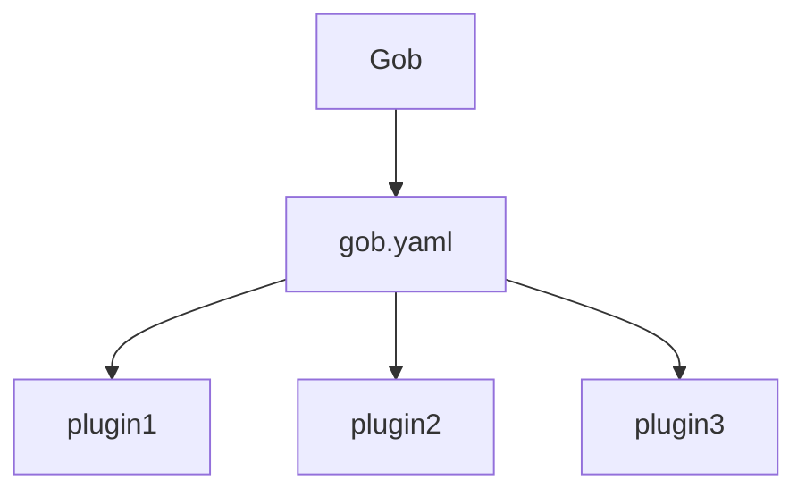

## How gob works
`Gob` takes everything defined in the `gob.yaml` as plugin.

You just need to tell `gob` 3W(where,when and what)

1. **Where** : where to download the tool
2. **When** : when to execute to command
2. **What** : what to do with the tool

Below is from `gob` project itself
```yaml
exec:
    commit-msg-hook: ^#[0-9]+:\s*.{10,}$
    pre-commit-hook:
        - lint
        - test
    pre-push-hook:
        - test
plugins:
    golangci-lint:
        alias: lint #When : when issue `gob lint`
        args: run ./... #What: execute `golangci-lint run ./...`
        url: github.com/golangci/golangci-lint/cmd/golangci-lint@v1.55.2 #Where: where to download the plugin
    gotestsum:
        alias: test
        args: --format testname -- -coverprofile=target/cover.out ./...
        url: gotest.tools/gotestsum@v1.11.0
```
in most cases you don't need to edit the configuration manually. you can achieve this by commands 

## Commands

### gob init
```shell
gob init
```
1. Initialize gob for the project, this is the first command you need to execute.
2. This command would set up built-in plugins
   3. golangci-lint (always with the latest version, you can change the version in `gob.yaml`)
   4. gotestsum
5. Generate a default `.golangci.yaml` in project root directory
6. Generate `gob.yaml` in project root directory
7. Set up git local hooks if current project has been version controlled

### gob build
```shell
gob build
```
1. This command would build binaries in the project.(If there are more than one main method in main package)
2. Final binaries will be built in the ${project_home}/target folder and named the same as go source name which contains main method in main package

### gob clean
```shell
gob clean
```
This command will clean all stuffs in the ${project_home}/target folder

### gob test
```shell
gob test
```
This command will test the project and generate coverage report

### gob lint
```shell
gob lint
```
This command will run lint against project based on the configuration. 
> For best practice, lint only check the changed files
```yaml
new-from-rev: HEAD
```

### gob plugin install
```shell
gob plugin install 
```
1. Install a tool as gob plugin and gob would generate the corresponding part in `gob.yaml`
2. If you don't specify version, gob would install the latest version of tool
> you can update `alias` and `version` at anytime. 

for example

```shell
gob plugin install github.com/golangci/golangci-lint/cmd/golangci-lint
```

### gob plugin list
```shell
gob plugin list
```
list all the defined plugins in project

### gob deps
```shell
gob deps
```
Display project dependency as tree view


